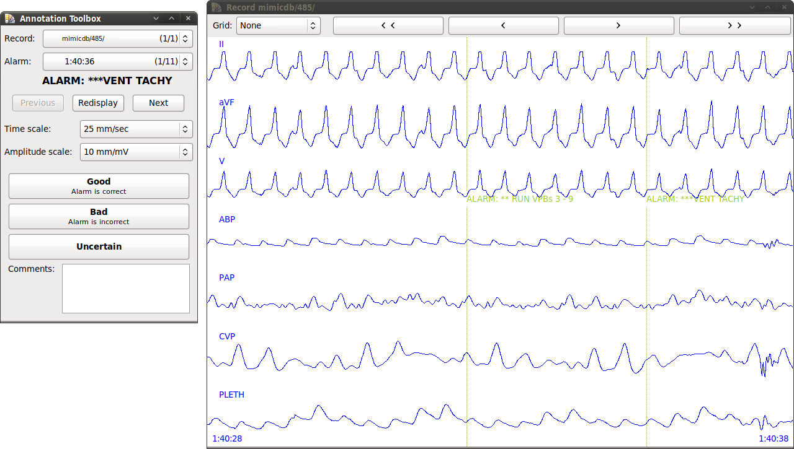

# metaann

metaann is a system for reviewing and labelling events in
physiological waveforms.  This system was built and used from about
2013 to 2017, to annotate several large collections of waveform data
at the MIT Laboratory for Computational Physiology.

This system was built to solve a very specific problem.  We have a
collection of long-duration, multi-channel waveform recordings (ECG,
PPG, blood pressure, etc.)  And for each of those recordings, we have
a list of events that were detected by some automated classifier.  We
have thousands of these events, and we want to group the events into
buckets (e.g. "ventricular arrhythmia" versus "motion artifact") for
later study.  We also wanted to have several people review each event
independently, to be sure they agreed.

As such, we needed a process that would allow a person to quickly
review each event.  It needed to allow the reviewer to focus on their
task, which meant that the UI needed to load and display data without
any perceptible delay, require only one click to submit an answer, and
save the answers to a central server automatically.

The metaann client is a heavily modified, stripped-down version of
WAVE.  It uses GTK+ 2.24 (because that made it easy to port WAVE's
Xlib display code to work natively on Windows and Mac OS.)  Naturally,
it uses WFDB, and libcurl.

The metaann server is implemented using CGI.pm.  It relies on the
PhysioNetWorks user authentication system.  If you want to deploy it
yourself, you'll have to provide your own authentication system and
modify the scripts to work with it.  Or write your own server; the
HTTP API is not terribly complicated.

One significant issue we discovered - obvious in retrospect - is that
not everyone works at the same speed.  Some reviewers are highly
productive and motivated, and can routinely review hundreds of events
per week, while other reviewers will only review a handful of events
now and again.  If you have a specific target to achieve (e.g.,
maximizing the number of events that have at least two independent
reviews), you can't simply divide up the database evenly among all the
reviewers.  The metaann system has no mechanism for addressing this
situation, and required active involvement from the administrator
(manually re-partitioning and re-shuffling the record assignment
lists) in order to make effective use of everyone's time.
